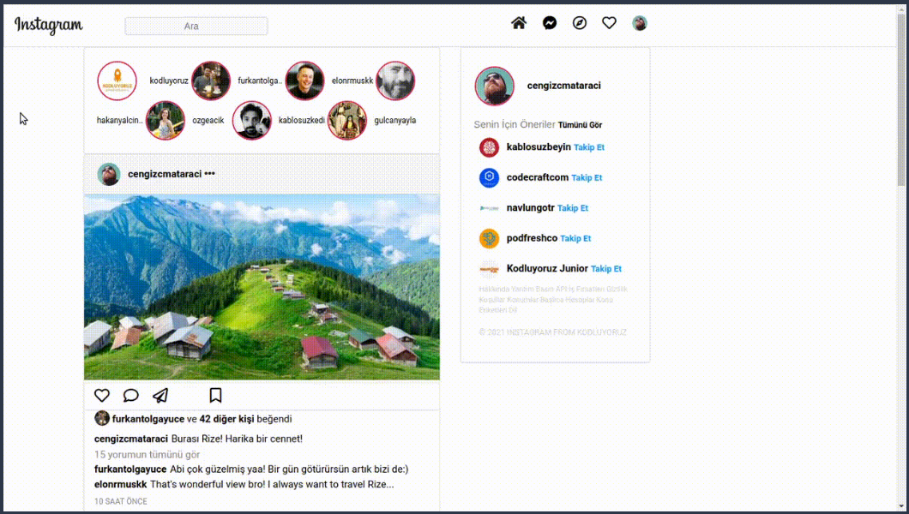

# Instagram clone

Bu ödevde hazır olarak verilen Instagram projesinde task olarak verilen değişiklikleri yaparak
istenen hale getirilmesi hedefleniyor.

Hazır olarak verilen instagram proje: https://drive.google.com/drive/folders/1hRWmpYpuax4Aqsf_BRKdpDoNUowTpzKe

Task: https://academy.patika.dev/courses/bootstrap/odev2

### Verilen görevleri olabildiğince tamamlamaya çalıştım ve son halini yükledim
https://github.com/elifbeyzatok00/Kodluyoruz/assets/102792446/580f49e1-8562-46b7-8a9d-4c393a2acc79

