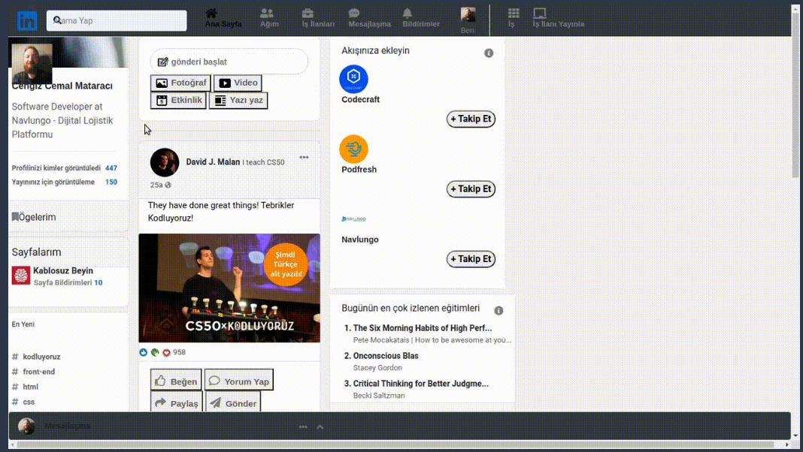

# Linkedin clone

Bu ödevde hazır olarak verilen Linkedin projesinde task olarak verilen değişiklikleri yaparak istenen hale getirilmesi hedefleniyor.

Hazır olarak verilen Linkedin proje: https://github.com/Kodluyoruz/taskforce/tree/main/bootstrap/odev3/bootstraplinkedinclone

Task: https://academy.patika.dev/courses/bootstrap/odev3

<!-- ### Verilen görevleri olabildiğince tamamlamaya çalıştım ve son halini yükledim -->

